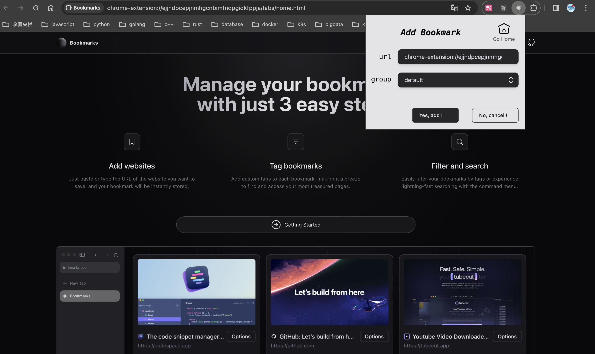
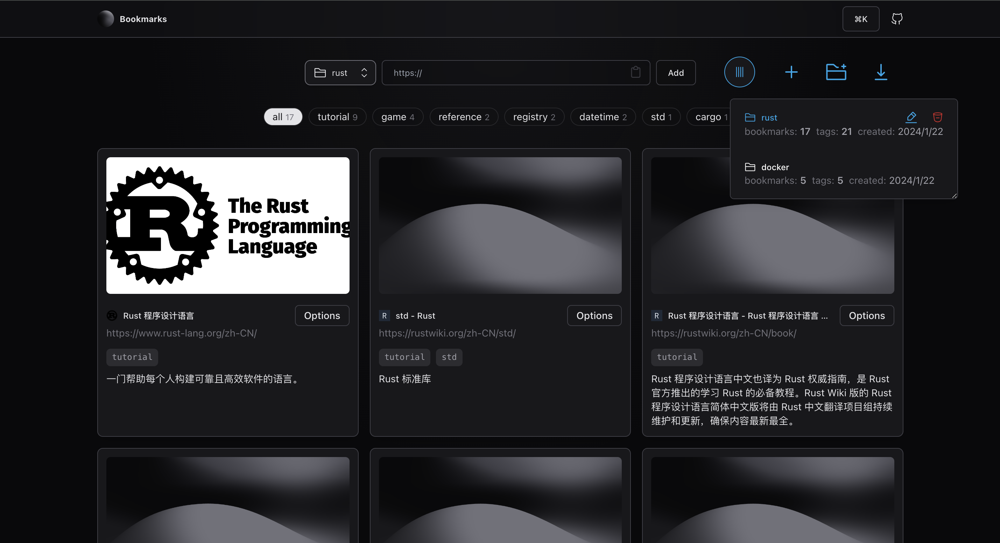

[English](./README.md) | [中文](./README.ZH_CN.md)

<p align="center">
  
  
  
  

  
</p>

<p align="center">
  <a href="#dart-about-the-repository">About the Repository</a>   |
  <a href="#hammer-technologies">Technologies</a> |
  <a href="#rocket-how-to-run">How to Run</a>   |  
  <a href="#handshake-acknowledgments">Acknowledgments</a> | 
  <a href="#memo-License">License</a>
</p>
<br>

> 😡😡😡Dumping nuclear wastewater into the ocean, damn it! 💣🗾💥😤😤😤

# 🎯 About the Repository

This repository is forked from https://github.com/br4adam/bookmarks, an application designed to easily manage web bookmarks. Compared to the original repository, this repository mainly made the following changes:

* Transformed into a Chrome extension.
* Removed the `supabase` dependency and related login authentication modules.
* Added bookmark groups management.
* Added bookmark import and export functions.
* Changed the method of obtaining web page metadata, eliminating dependency on limited online services.
* Altered the method of fetching icons, reducing reliance on limited online services.
* Simplified some UI.
* Other minor changes.





# 🔨 Technologies

* [`react`](https://react.docschina.org/)
* [`headlessui`](https://headlessui.com/)
* [`tailwindcss`](https://tailwind.nodejs.cn/)
* [`zustand`](https://zustand-cn.js.org/)
* [`plasmo`](https://www.plasmo.com/)
* [`pnpm`](https://www.pnpm.cn/)

# 🚀 How to Run

## 1. Build from Source

```shell
git clone git@github.com:young2j/bookmarks-extension.git
cd bookmarks-extension
pnpm install
pnpm build
```

After that, a folder named `chrome-mv3-prod` will be generated in the `build/` directory.

Load the aforementioned unpacked extension at the `chrome` browser extension management page `chrome://extensions/`.

## 2. Download the Released zip File

Download the `bookmarks-extension.zip` directly from the [`releases`](https://github.com/young2j/bookmarks-extension/releases) page, unzip it, and load it at the `chrome` browser extension management page `chrome://extensions/`.

# 🤝 Acknowledgments

[https://github.com/br4adam/bookmarks](https://github.com/br4adam/bookmarks)

## 📝 License

This project is licensed under the MIT License. For more details, see the [LICENSE](LICENSE.md) file.

Made with ❤️ by [young2j](https://github.com/young2j)
